# Programmentwurf_Bildverarbeitung

Gruppe: Luca Müller, Jonas Hinkel, Jonas Ledig, Frederic Stepp

## Aufgabe: Erkennen und Ausschneiden von PCB aus Bildern und in Ordner einordnen
Aufgabenstellung auf [Website zur Vorlesung](https://virtlab.fakultaet-technik.de/Vorlesungen/Bildverarbeitung.html#/Programmentwurf) zu finden

Abgabe: 20.02.2024, online


##### Problem: PCB sind wesentlich inhomogener als Cashew-Nüsse

Bilder hier zu finden: [Google Drive](https://fs7.eu/programmentwurf-source)

Lösungsideen

1) Kantenerkennung (PCB ist rechteckig)
   1) Mit Kanten Konturen finden, um Konturen kleinstmögliches Rechteck legen
   2) Pins des PCB sind sehr dünn, haben ähnliche Farbe wie Hintergrund
   3) Manche PCB haben deutlich helle Kanten auf allen vier Seiten (gut) andere sind nicht so gut zu Erkennen
   4) Vor Kantenerkennung ggf nach Farben Filtern
2) Lokalisierung der 4 Bohrlöcher
   1) Anahnd der Abständer Skalierung und Rotation berechnen und so den zu extrahierenden Bereich ermitteln
   2) Frage: Wie zuverlässig?
   3) Alternativ: Andere Komponenten als Orientierungspunkte erkennen
3) Ein SVM-Modell trainieren das PCB von Hintergrund unterscheiden kann
   1) Konturen finden und dann kleinstmögliches Rechteck bestimmen
   2) Mögliche Herausforderung: Pins sind nicht sehr gut von Hintergrund zu unterscheiden
      1) Eventuell kann auch hier der Trick angewedente werden nur das PCB zu erkennen und dann "manuell" um die nötige Größe nach oben zu verlängern um auch die Pins mit im Bild zu haben


###### 1) Versuch mit Kantenerkennung

Dieser Ansatz wurde im Vorfeld der Gruppenarbeit von einem Gruppenmitglied getestet und hier dokumentiert. Durch die aufgetretenen Probleme wurde dieser Ansatz nicht weiter verfolgt, da die Realisierung mittels SVM gut funktionierte.


Erste Kantenerkennung:
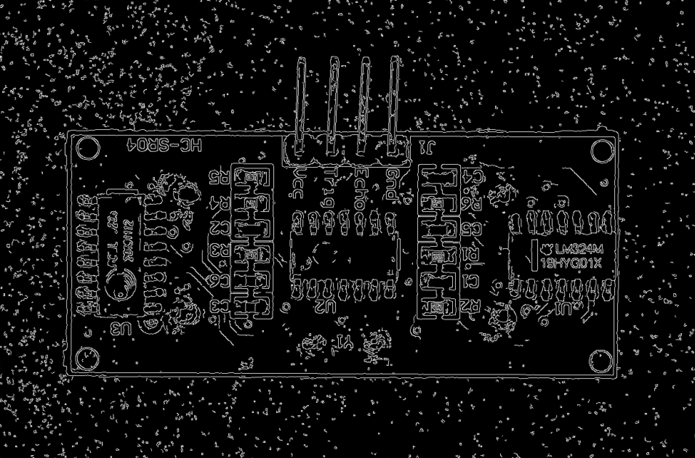

Update mit Gauss-Weichzeichner vor der Kantenerkennung:
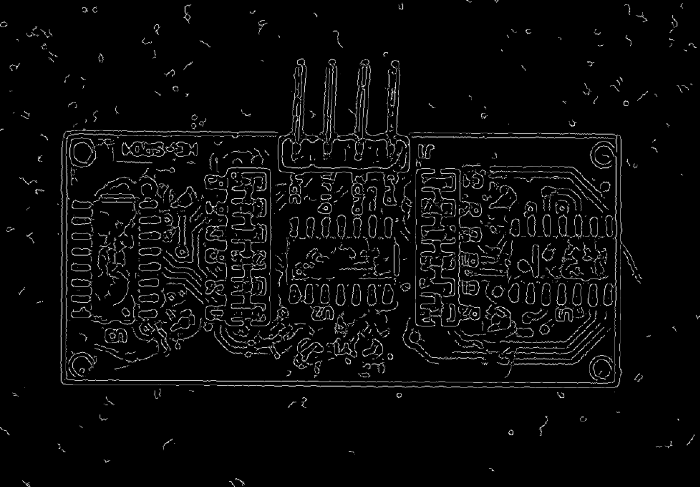

Konturenfindung und Rechteckbestimmung:
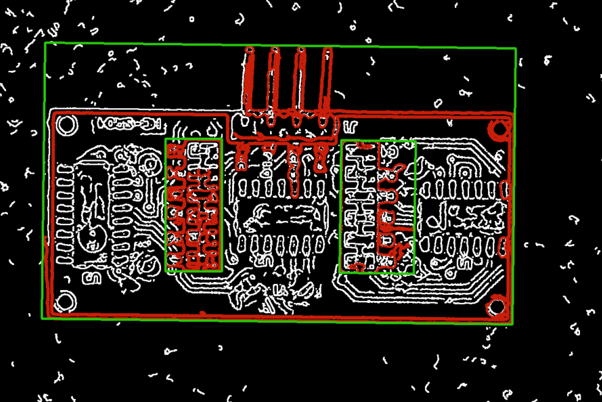
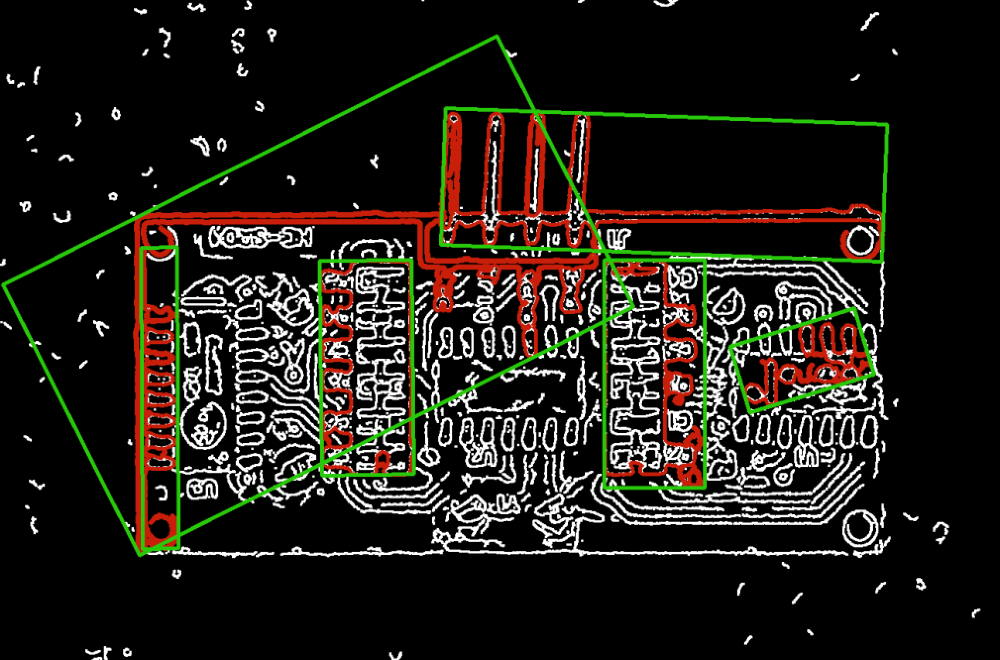

Wie zu sehen: Noch keine zuverlässige Auswahl des PCBs möglich.

**Neuer Ansatz:** 
Zu Beginn wurde eine Blaumaske hinzugefügt:
Bildbereiche mit den Bedingungen (b >120) & (r>10) werden auf weiß gesetzt, der recht auf schwarz:
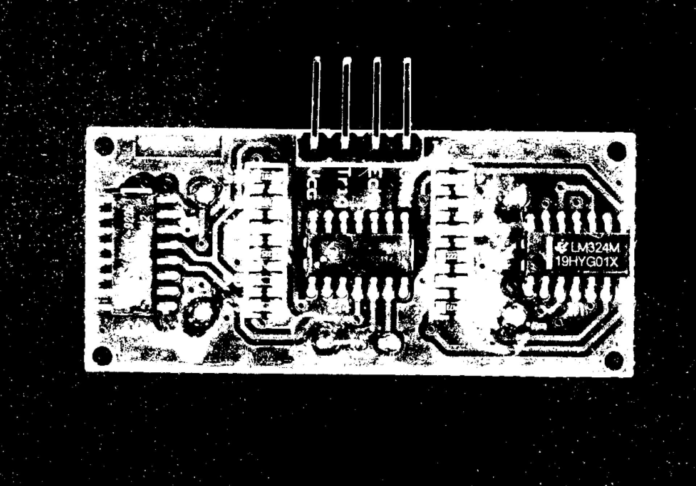

Erneute Anwendung der obigen Schritte führten zu besseren Ergebnissen:
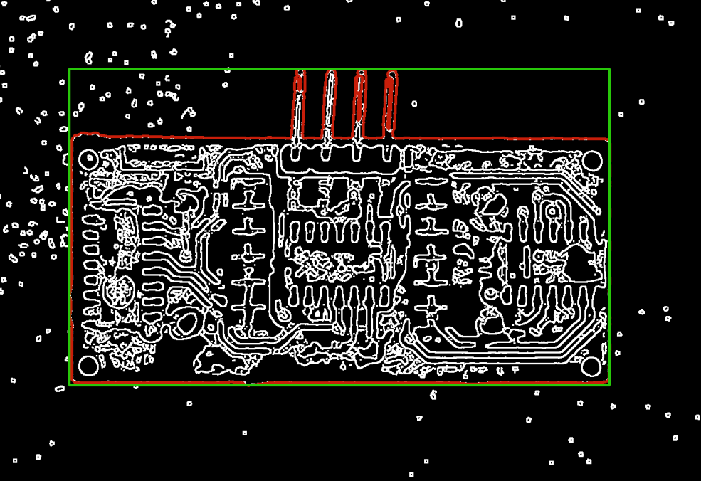

Das Rechteck wird ins urpsrüngliche Foto eingezeichnet:
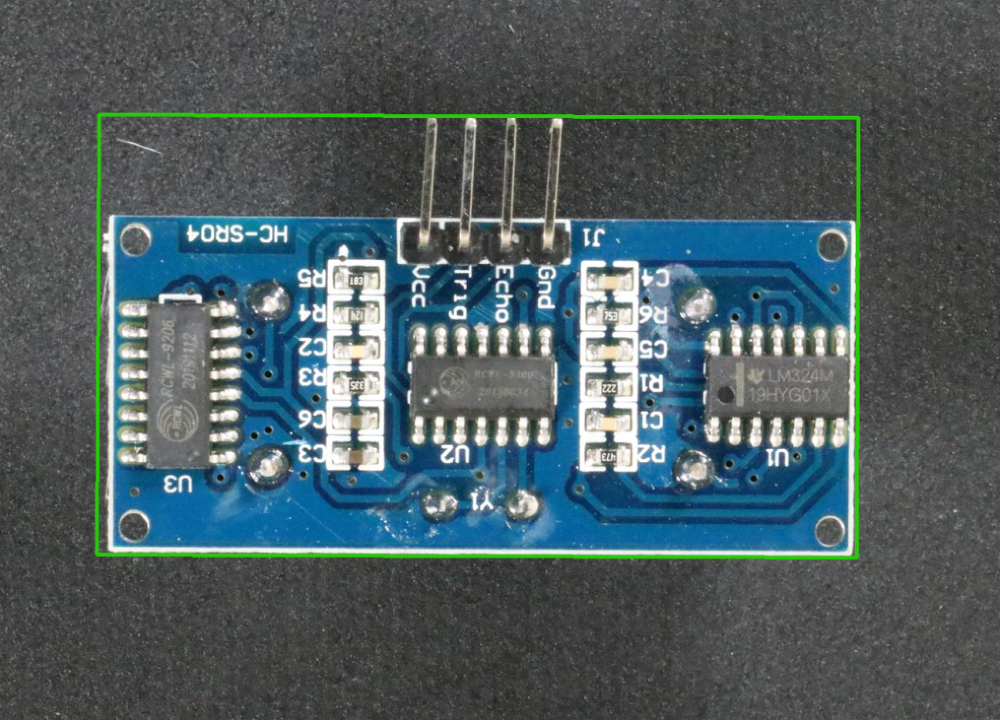
Und zugeschnitten/ gedreht:
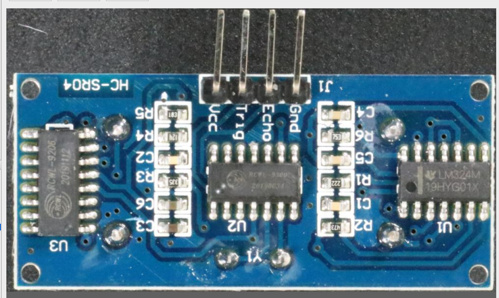

Bei der Batch-Bearbeitung fielen weitere Fehler auf. Fast ausschließlich bei anomalen PCBs, bei denen die Belichtung des Fotos nicht optimal war und dadurch der Hintergrund nicht eindeutig getrennt wurde:
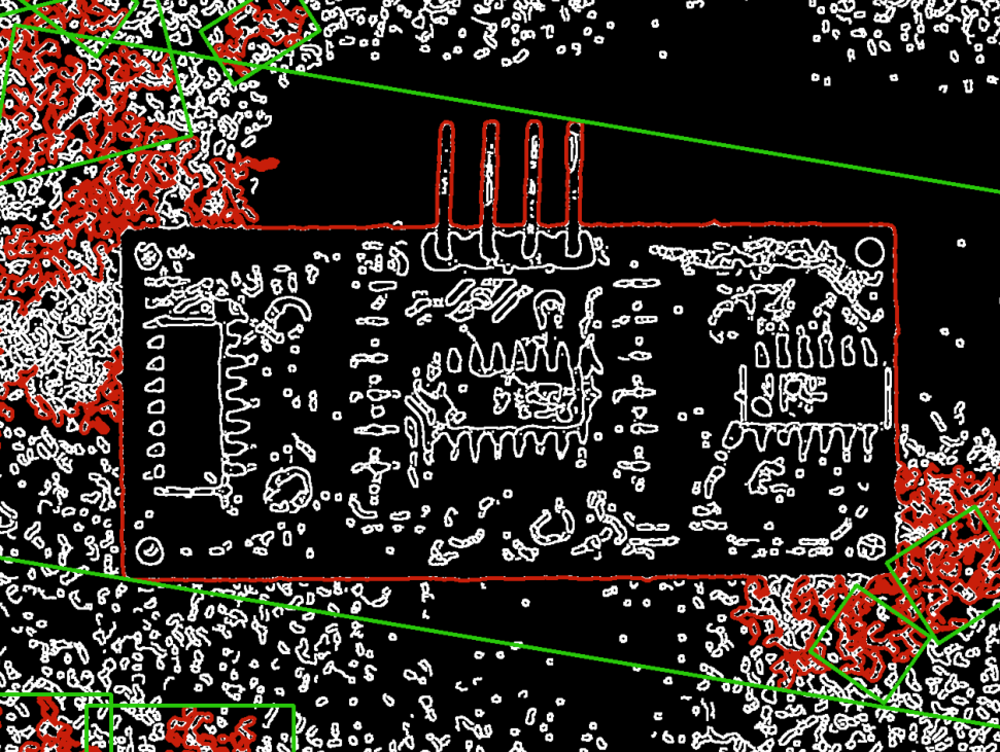


##### 2) Lokalisierung der 4 Bohrlöcher
Dieser Ansatz wurde nicht getestet aufgrund der guten Ergebnisse des SCM-Modells.

##### 3) SVM-Modell trainieren das PCB von Hintergrund unterscheiden kann

###### 3.1) Vorgehen für ein Einzelbild

1) Bild wählen, welches zum Trainieren des Modells verwendet werden soll
   
   In diesem Bild wurden jeweils manuell zwei Pixel gewählt, die den Hintergrund, die überstehenden Pins und das PCB repräsentieren, daraus ergaben sich die folgenden BGR-Werte:
   ```python
   pin_1 = [179, 193, 199]
   pin_2 = [144, 154, 164]
   blau_dunkel = [94, 54,  2]
   blau_hell = [187, 120,  11]
   hintergrund_dunkel = [50, 53, 51]
   hintergrund_hell = [132, 130, 129]
   ```
   Diesen wurden entsprechend die Label 0, 1, 2 zugewiesen:
   ```python
   labels=[0,0,1,1,2,2]
   ```
   Anhand dieses kleinen Datensatzes wurde die Support Vector Machine in der Funktion `train_svm()` trainiert.


2) Beispielbild, dessen Bereiche klassifiziert werden sollen:
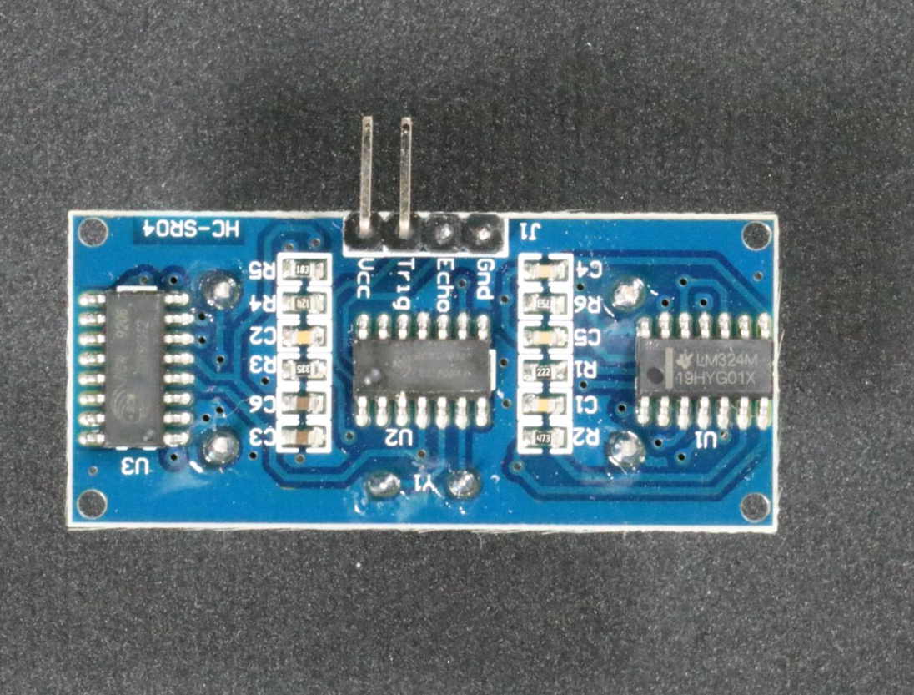

(Falls gewünscht, kann zur schnelleren Verarbeitung das Bild verkleinert werden)

3) Anhand der trainierten SVM wird das Bild mit der Methode `predict_svm(svm, image)` klassifiziert, der das trainierte SVM-Modell und das Bild übergeben wird.
4) Das Bild wird in die Klassen 0, 1, 2 eingeteilt, wobei 0 den Pins, 1 dem PCB und 2 dem Hintergrund entspricht und dann eingefärbt, jeweils in der ersten Farbe der jeweiligen Klasse.
> 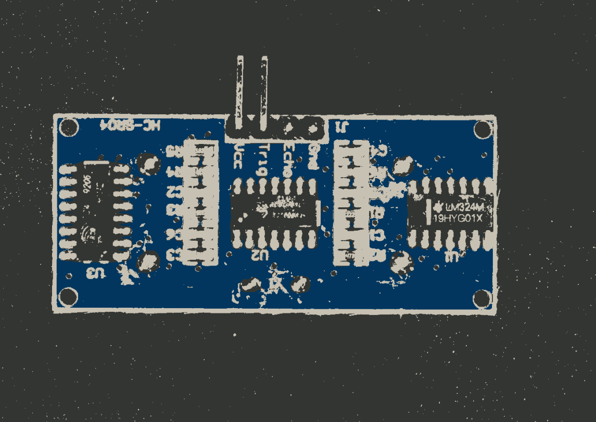
>
> In drei Klassen unterteilt

5) Da wir am Ende eine Box um das PCB und die Pins ziehen wollen, fassen wir Pins und PCV zusammen und erstellen ein Schwarz-Weiß-Bild, in dem die Pins und das PCB weiß und der Hintergrund schwarz ist.

> 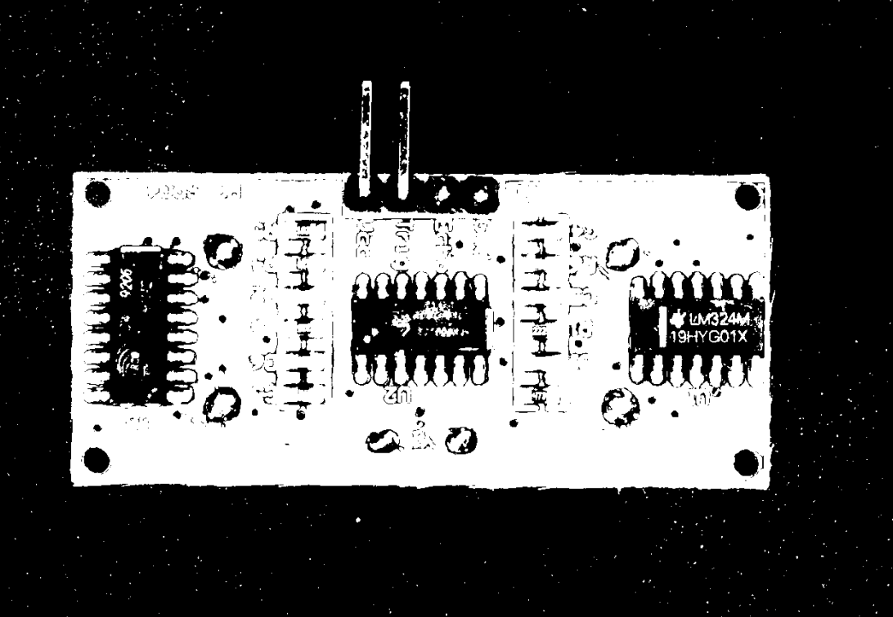
>
> In Schwarz-Weiß umgewandelt

6) In diesem Bild werden nun die Konturen mit der Methode `find_contours(image)` gefunden und nur Konturen beachtet, die eine Fläche von mindestens 150 Pixeln haben (grün eingezeichnet):
>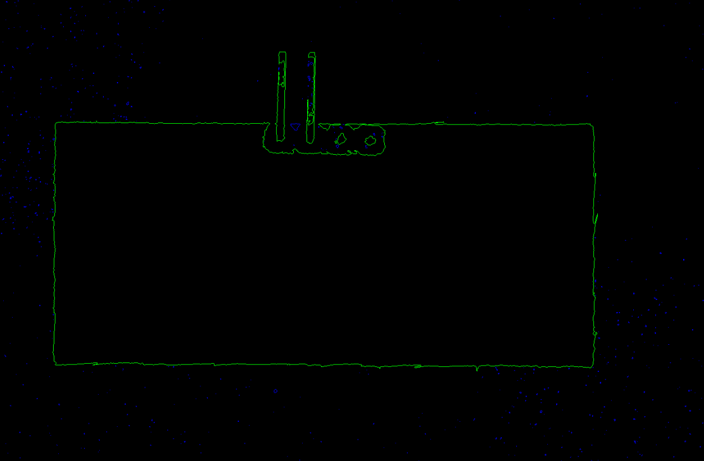
>
> Grüne Konturen: Fläche > 150 Pixel, Blaue Konturen: Fläche < 150 Pixel

7) Problem: Wenn alle Konturen der Pins getrennt vom PCB sind, kann mit der Funktion `cv2.minAreaRect(contour)` kein Rechteck gefunden werden, welches gleichzeitig alle Konturen beinhaltet:
>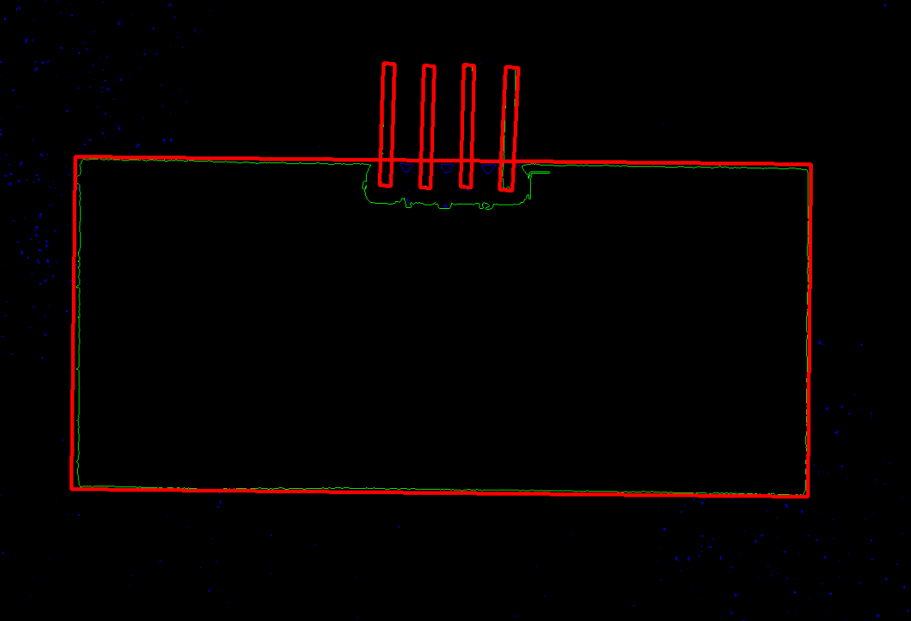
>
>Die Pins werden zwar erkannt aber hängen nicht mit dem PCB zusammen.

Als einfacher Workaround, wird zunächst das Rechteck um die größte Kontur, sowie die restlichen Konturen selbst gezeichnet und ausgefüllt. Das Ergebnis ist ein Bild, in dem das PCB und die Pins weiß und der Hintergrund schwarz ist, wobei sich die jeweiligen Bereiche überschneiden:

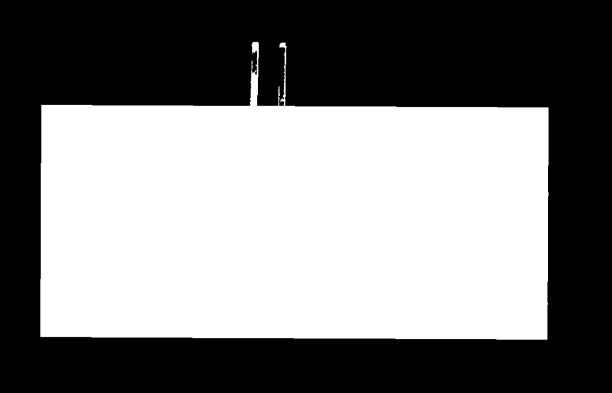

8) Wie oben bereits geschehen, werden in diesem Bild die Konturen gefunden und nur die größte Kontur weiter betrachte. Dies verhindert, dass mögliche Konturen, welche den Hintergrund betreffen, nicht mehr mit einbezogen werden.

9) Um die neu gefundene Kontur wird nun wieder das kleinste Rechteck gezeichnet:
>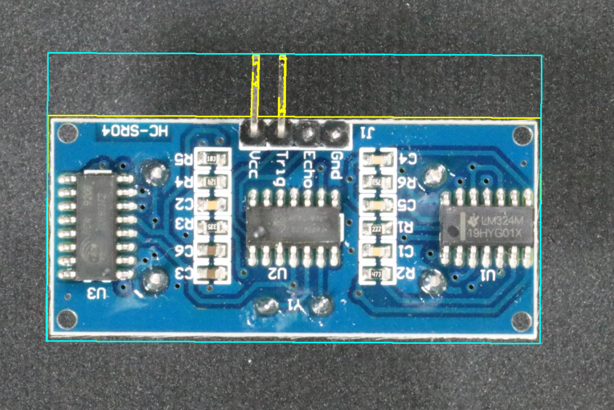 
>
> Gelb: Kontur um das PCB, blau: Kleinstes Rechteck um die Kontur

10) Durch Bestimmung der Ecken des Rechtecks wird die Höhe und Breite des Zielbildes bestimmt und eine Transformationsmatrix M mithilfe der Funktion `M = cv2.getPerspectiveTransform(src_pts, dst_pts)
` errechnet, welcher die Ecken des gefundenen Rechtecks (src_pts) und die Ecken des Zielrechtecks (dst_pts) übergeben werden.

11)   Das Bild wird mithilfe der Funktion `cv2.warpPerspective(image, M, (width, height))` transformiert, wobei width und height die Breite und Höhe des Zielbildes sind. Falls die Breite kleiner ist, als die Höhe, wird das Bild um 90° gedreht.
  
12)  Das Ergebnis ist das ausgeschnittene und gedrehte PCB:    

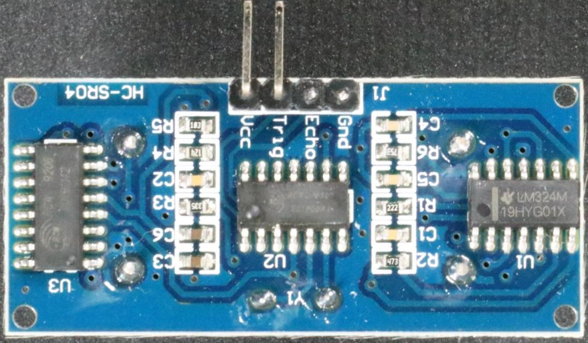

13)  Da einige Ausgangsbilder um 180° gedreht sind, wird in einem letzten Schritt überprüft, ob sich im unteren Bereich das PCB befindet.
Dafür wird mit der Funktion `rotation_korrigieren(cropped_image,svm)` ein schmaler Streifen (2% der Bildhöhe) im unteren Bereich des Bildes gewählt und erneut mit dem SVM Modell klassifiziert.
Werden hier weniger als 1000 Pixel gefunden, welche dem PCB entsprechen, wird das Bild um 180° gedreht. Hier werden zwar PCBS, welchen die Pins komplett fehlen nicht gedreht, allerdings würden diese in der späteren Auswertung ohnehin immer als fehlerhaft aussortiert werden.

Damit ist die Verarbeitung eines einzelnen Bildes abgeschlossen.
Zur Veranschaulichung des gesamten Prozesses werden die Zwischenergebnisse in der GUI dargestellt.

###### 3.2) Vorgehen für mehrere Bilder (Batch-Verarbeitung)

Wird der Programmentwurf selbst aufgerufen, ohne die GUI zu verwenden, wird die Batch-Verarbeitung gestartet.

1) Hier wird der Nutzer zunächst aufgefordert, den Pfad zu den Bildern anzugeben, welche verarbeitet werden sollen. Dies geschieht mithilfe der Funktion `get_images()`, welche das Modul `tkinter` verwendet und ein Fenster öffnet, in dem ein Ordner ausgewählt werden soll.
2) Anschließend wird der Nutzer aufgefordert, den Pfad zu den Bildern anzugeben, unter welchem die Ergebnisse gespeichert werden sollen. Dies geschieht mithilfe der Funktion `get_output_folder()`.
3) In einem ursprünglichen Ansatz wurden die Bilder nacheinander verarbeitet, was zu relativ langen Laufzeiten führte. Daher wurde die Verarbeitung der Bilder parallelisiert, wozu das Python Modul `multiprocessing` genutzt wurde. Dieses ermöglicht es, die Verarbeitung der Bilder auf mehrere Prozesse aufzuteilen, wodurch die Laufzeit deutlich verkürzt wird: Obwohl die Verarbeitung eines einzelnen Bildes weiterhin, je nach System 200 - 300 ms dauert, können alle 1100 Bilder innerhalb von ca. 1 Minute verarbeitet werden, was einer Laufzeit pro Bild von ca. 50 ms entspricht.
4) In der Funktion `verabeiten(file, output_dir)` wird - im Gegensatz zur Funktion `run()`, welche für die GUI genutzt wird - das Ergebnis am Ende als PNG-Datei gespeichert.
5) Hierbei wird der Dateiname beibehalten und um '_crop' erweitert, um das Ergebnis zu kennzeichnen.
6) Als Speicherort wird das Verzeichnis gewählt, welches der Nutzer zuvor ausgewählt hat. Hier werden die Bilder zufällig in den Unterordner `test` oder `lernen` verteilt. Dafür wird die Funktion `random.random()` genutzt.
   - _Anmerkung_: Auch wenn die Verteilung gegebenenfalls nicht perfekt 10% und 90% entspricht, ist dies für das Training des später zu entwickelnden Modells nicht weiter relevant, da hier die Größenordnung der Klassen entscheidend ist und nicht die genaue Anzahl.
7) Damit die zugeschnittenen Bilder weiter den Klassen Normal und Anomaly zugeordnet werden können, wird die Information aus dem Dateipfad der Quelldatei extrahiert und das Bild im entsprechenden Unterodner gespeichert.
8) Die Struktur des Zielordners ist dann wie folgt:
   - Zielordner
     - lernen (90%)
       - Normal
       - Anomaly
     - test (10%)
       - Normal
       - Anomaly

### Fazit

Der Ergebnisdatensatz kann hier abgerufen werden: [Google Drive](http://fs7.eu/programmentwurf-result)


 - **Genauigkeit**: Zum Großteil sind die Dateien sehr gut ausgerichtet und zugeschnitten. Nur vereinzelt gibt es Ungenauigkeiten, wie z.B. bei folgendem Bild, bei dem der Ausschnitt zu groß gewählt wurde:
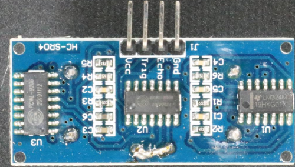

 - **Laufzeit**: Die Bearbeitung eines einzelnen Bildes dauert 100-200ms, allerdings kann diese Zeit in einer Batchbearbeitung auf ca. 50ms pro Bild verringert werden. Für eine Produktionsanlage, bei der eine schnelle Sortierung gewünscht ist, könnte dies bereits zu langsam sein. Durch eine Verbesserung des Algorithmus sollte es möglich sein, die Laufzeit um ein Vielfaches zu verringern. 

 - **Robustheit**: Beim zur Verfügung gestellten Datensatz wurden alle Bilder korrekt ausgeschnitten (mit leicht variierender Genauigkeit). Bei Bildern mit anderer Belichtung oder anderen Farben könnte die Verarbeitung erschwert werden. Außerdem müsste für eine höhere Robustheit bei neuen Daten auch die Auflösung der Bilder betrachtet werden, da teilweise feste Schwellenwerte (z.b. für die minimale Konturgröße) gewählt wurden. 

 Abschließend bleibt festzustellen, dass dieser intuitive Ansatz wahrscheinlich nicht genau so in einer Industrieanlage angewendet werden würde, allerdings hier zu guten Ergebnissen geführt hat. 

